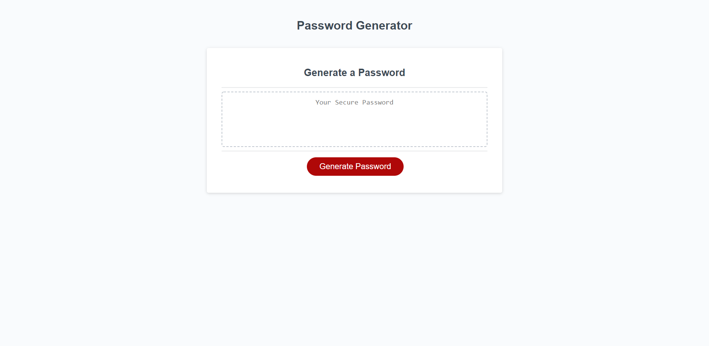

# Password Generator

This is a password generator using Javascript, HTML & CSS. 

## Functionality

This webpage generates a random password based on the critiera selected by the user. 

The password must be 8-128 characters long, as decided by the user via a prompt. 

The application confirms whether the user wants to use:
* Uppercase letters
* Lowercase letters
* Numbers
* Special characters

When the button titled Generate Password is clicked, the first prompted is activated.

The password is randomized and displayed in the text area box after the user selects their desired criteria. 

## Additional Info

Deployed [Password Generator](https://gaitherdb.github.io/Password-Generator-JS/) site on Github.

This application is made only using what we learned in class. I made use of the prompt, alert, & confirm attributes along with If statements and For loops.

**Version 1.0**